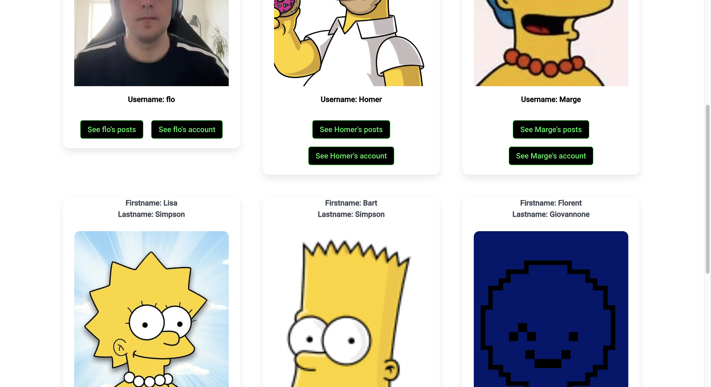

# Project 4 - Codestream App

## Table of contents

- [Description](#description)
- [Deployement](#deployement)
- [Timeframe & Working Team](#timeframe--working-team)
  - [Home page](#home-page)
  - [Stream page](#stream-page)
  - [Signup page](#signup-page)
  - [Login page](#login-page)
  - [Unique Post page](#unique-post-page)
  - [My Stream](#my-stream)
  - [Dashboard](#dashboard)
  - [Other user's page](#other-users-page)
- [Technologies used](#technologies-used)
- [Brief](#breif)
- [Planning](#planning)
- [Build Code Process](#build-code-process)
  - [Comment component code](#comment-component)
  - [Like component code](#like-component)
  - [Cloudinary component code](#Cloudinary-component)
- [Wins](#wins)
- [Challenges](#challenges)
- [Key Learnings/Takeways ](#key-learningtakeaway)
- [Bugs](#bugs)
- [Future Improvements](#future-improvements)

## Description

Work by yourself to:

 - Build a full-stack application by creating your own backend and frontend.
 - Use PostgreSQL and Flask Python to develop your own API.
 - Consume your API with a separate frontend built with React.
 - Develop a complete product, likely including multiple relationships and CRUD functionality for at least a couple of models.
 - Implement thoughtful user stories and wireframes to identify core MVP features and determine which features can be cut.
 - Design visually impressive interfaces to enhance your portfolio and impress future clients and employers. Make sure to allocate sufficient time for this.
 - Deploy the application online to make it publicly accessible.

### Main app

I decided to work on a developer focused social media where users can signup and login. Each user would be able to:
- Post on the main channel
- Update they own posts
- Delete they own post
- Update account details
- Upload picture from their device 
- Look for other users
- See other users profiles and stream
- Comment and like on each posts

## Deployment

We used Netlify to deploy our frontend and Heroku to deploy our backend.

[Link to the APP](https://codestreamsocialmedia.netlify.app/)

### Frontend
1. Clone the repository.
2. Navigate to the project directory.
3. Run `npm install`.
4. Run `npm run dev`. This should open a localhost page in your browser.

### Backend
1. Clone the repository.
2. Navigate to the project directory.
3. Run `pipenv install`.
4. Run `pipenv run python seed.py`.
5. Run `pipenv run flask run`.


## Timeframe & Working Team
This was a 9-day solo project.

- I strategically set clear tasks on a daily basis to achieve my goals.
- At the end of each day, I reviewed and adapted the tasks for the following day based on the progress made.

### Home page


### Stream page


### Signup page


### Unique post page


### My stream


### Dashboard


### Other user's page



## Technologies Used
- Frontend: Developed using React.js with a router on the main app for building the user interface.
- CSS: Utilised a hybrid approach with Bulma as the framework along with some custom CSS.
- Backend: Built the API using Flask, SQLAlchemy, and Marshmallow.


## Brief
The objective of this project was to build a React application using our own API with PostgreSQL and Python that I learned during my lectures.

### Frontend
This involved API fetching, routing, and mapping, selecting only what was needed from the API. The document structure had to use different components with router and routes on the main app.

### Backend
I built the back end using Flask Python.
- **Model**: This is where all our models and schemas are located, and where I defined the mandatory elements required to create a new entry.
- **Controller**: This is where I implemented all our functions depending on what actions I wanted the user to perform (e.g., create an account, add a new wine, or just log in). I also included all our routes in our controllers.

I used PostgreSQL as our SQL database.

Additionally, I had a seed folder where our original database was going to be seeded initially.


## Planning
### Frontend
```plaintext
|--public
|   |--_redirect
|--src
|   |--assets
|   |    |--images
|   |--components
|   |      |--AboutUs.tsx
|   |      |--Comment.tsx
|   |      |--ContactUs.tsx
|   |      |--Dashboard.tsx
|   |      |--Footer.tsx
|   |      |--Home.tsx
|   |      |--Login.tsx
|   |      |--MyStream.tsx
|   |      |--Navbar.tsx
|   |      |--Post.tsx
|   |      |--PostcardFull.tsx
|   |      |--PostcardFullComment.tsx
|   |      |--PostList.tsx
|   |      |--ShowPost.tsx
|   |      |--Signup.tsx
|   |      |--UpdtateAccount.tsx
|   |      |--UpdateAvatar.tsx
|   |      |--UpdateComment.tsx
|   |      |--UpdatedPost.tsx
|   |      |--UserCard.tsx
|   |      |--UserDashboard.tsx
|   |      |--UserList.tsx
|   |      |--UserPosts.tsx
|   |--interfaces
|   |      |--comment.ts
|   |      |--like.ts
|   |      |--post.ts
|   |      |--user.ts
|   |--styles
|   |    |--main.scss
|   |--App.tsx
|   |--index.d.ts
|   |--main.tsx
|   |--README.MD

```
### Backend
```plaintext
|--config
|   |--environment.py
|--controllers
|   |--comment_controller.py
|   |--post_controller.py
|   |--like_controller.py
|   |--user_controller.py
|--middleware
|   |--secure_route.py
|--models
|   |--comment_model.py
|   |--post_model.py
|   |--user_model.py
|--serializers
|   |--comment_serializer.py
|   |--post_serializer.py
|   |--user_serializer.py
|--.env
|--app.py
|--pipfile
|--pipfile.lock
|--Procfile
|--seed.py

```

## Build Code Process
I initiated the project by setting up the backend structure and the basic React framework, and then started building on this foundation. I was particularly proud of implementing the comment, like, and add picture functionalities.

### Comment component
For comment function, I had both a front-end and a back-end part:

#### Frontend
- **Cloning Form Data:** On the frontend, Ihad to clone the form data and create a new field that Iposted into the API.
- **Error Handling:** Additionally, Iimplemented error handling to manage any issues that occurred during form submission.
```jsx
  function handleChange(e: any) {
    const fieldName = e.target.name
    const newFormData = structuredClone(formData)
    newFormData[fieldName as keyof typeof formData] = e.target.value
    setFormData(newFormData)
    setErrorData("")
  }

  async function commentPost(e: SyntheticEvent) {
    try {
      const token = localStorage.getItem('token')
      const resp = await axios.post(`${baseUrl}/posts/${id}/comments`, formData, {
        headers: { Authorization: `Bearer ${token}` }
      })
      const newFormData = structuredClone(formData)
      if (resp.data.message) {
        throw new Error(resp.data.message);
      }
      location.reload()
    } catch (e: any) {
      setErrorData(e.message)
    }
  }
```
#### Back end
- **Handling Submitted Text:** On the backend, I processed the text submitted to the body and saved it into our API.
- **Console Error Handling:** Additionally, I integrated console error handling to identify and address any errors that occurred during processing.
```jsx
@router.route("/posts/<int:post_id>/comments", methods=["POST"])
@secure_route
def create_comment(post_id):

    comment_dictionary = request.json

    existing_post = PostModel.query.get(post_id)
    if not existing_post:
        return {"message": "No post found"}, HTTPStatus.NOT_FOUND

    try:
        comment = comment_serializer.load(comment_dictionary)
        comment.user_id = g.current_user.id
        comment.post_id = post_id
        comment.save()
    except ValidationError as e:
        return {"errors": e.messages, "message": "Something went wrong"}

    return comment_serializer.jsonify(comment), HTTPStatus.CREATED
```

### Like componnent
For the Like function, Ihad both a front-end and a back-end part:
#### Front end
- **Checked If Liked Function:** On the frontend, I created a function to check if the post is already liked. This function was used for both the handleLike and handleDislike functions, so if the post is already liked, it will then be unliked.
- **Fetching and Posting to the API:** Additionally, I implemented fetching and posting to and from the API to interact with the backend and manage the like and dislike functionality.

```jsx
  function checkIfLiked() {
    like.filter(like => {
      if (like.user.id === currentUser?.id) {
        liked = "liked"
      }
    })
  }
  checkIfLiked()
  async function handleLike(e: SyntheticEvent) {
    try {
      const token = localStorage.getItem('token')
      const resp = await axios.post(`${baseUrl}/posts/${id}/likes`, formData, {
        headers: { Authorization: `Bearer ${token}` }
      })
      if (resp.data.message) {
        throw new Error(resp.data.message);
      }
      location.reload()
    } catch (e: any) {
      setErrorData(e.message)
    }

  }
  async function handleDislike(e: SyntheticEvent) {
    try {
      like.filter(async like => {
        if (like.user.id === currentUser?.id) {
          const token = localStorage.getItem('token')
          const resp = await axios.delete(`${baseUrl}/likes/${like.id}`, {
            headers: { Authorization: `Bearer ${token}` }
          })
        }
        location.reload()
      })

    } catch (error) {
    }
  }
```
#### Back end
- **Handling Likes and Dislikes:** On the backend, Iretrieved the post that needed to be liked or disliked. We then pushed or deleted the user into the posts array accordingly, updating the post's data in the database.
```jsx
@router.route("/posts/<int:post_id>/likes", methods=["POST"])
@secure_route
def like(post_id):
    existing_post = PostModel.query.get(post_id)
    if not existing_post:
        return {"message": "No post found"}, HTTPStatus.NOT_FOUND
    try:
        like = like_serializer.load({})
        like.user_id = g.current_user.id
        like.post_id = post_id
        like.save()
    except ValidationError as e:
        return {
            "errors": e.message,
            "message": "Something went wrong",
        }, HTTPStatus.BAD_REQUEST
    except Exception as e:
        return {"message": "Something went very wrong"}
    return like_serializer.jsonify("Liked")

@router.route("/likes/<int:like_id>", methods=["DELETE"])
@secure_route
def remove_like(like_id):

    like = LikeModel.query.get(like_id)
    if not like:
        return {"message": "No like found"}, HTTPStatus.NOT_FOUND

    like.remove()
    return {"message": "like Deleted"}, HTTPStatus.OK
```

## Wins
Boosting Confidence in React and Confirming Flask Work:

- **Deeper Understanding of Backend Development:** After completing this project, I now feel much more confident in developing a full-stack application using React.js and Flask Python. I have gained a deeper understanding of how the backend works and how all my endpoints communicate with each other.
- **Implementing Picture Upload Functionality:** Implementing the ability to add a picture from the device was a significant achievement for me, as it was a feature I wanted to include from a previous project.
- **Milestone: Comment and Like Features:** Additionally, implementing the comment and like features was a major milestone. It took me a whole day of research and coding for each feature, but the effort was worth it.

## Challenges
- **Remove Comment Functionality:** The main challenge around this project was the remove comment functionality, which I haven't been able to resolve yet.
- **Cascading Deletion Issues:** As stated below, due to the way I structured my models, I haven't been able to use cascading deletion to remove comments.

## Key Learning/Takeaway
1. If I were to do this project again, I would structure my backend models differently and carefully consider the main features needed and their dependencies. As a result, I was unable to implement cascading deletion.

## Bugs
Due to a lack of time and the structure of my models, users are unable to delete a post that has dependencies such as comments or likes.

## Future Improvements
- Implement functionalities to like and comment on other comments.
- Add the functionality to contact other users.
- Introduce the ability to follow other users and be followed by others.
